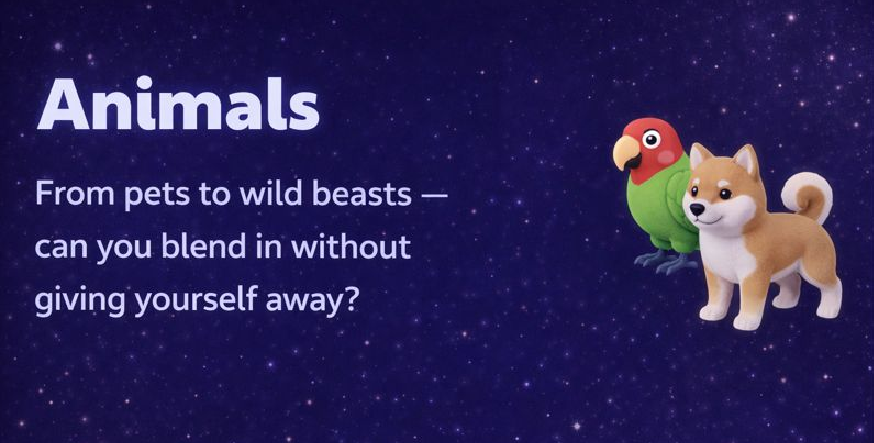

# Imposter Game (Preview)

A desktop party game built with Python + PyQt6, featuring QR-based role reveal and bilingual content (English/Arabic).

## What This Public Repo Contains
- Project preview only (screenshots/assets)
- No source code files

## Highlights
- Multi-category word packs
- Imposter/crew role flow
- QR private reveal for each player
- English + Arabic content support
- Companion content manager app

## Visual Preview

## Notes
- This repository is intentionally kept source-private.
- For collaboration/demo requests, contact the repository owner.
